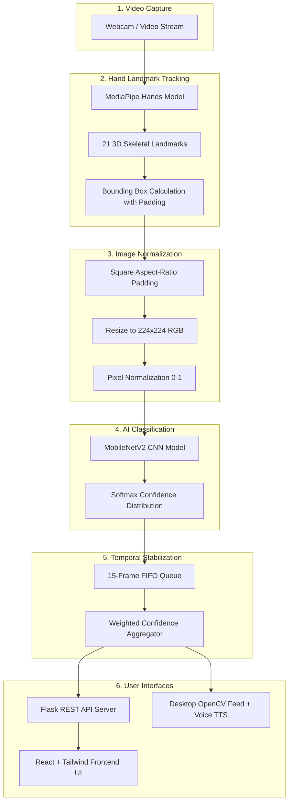

<div align="center">

# 🤟 ISL Translator (ISHARA)
### Real-Time Indian Sign Language Recognition & Translation Ecosystem

[](https://www.python.org/)
[](https://tensorflow.org/)
[](https://developers.google.com/mediapipe)
[](https://react.dev/)
[](https://vitejs.dev/)
[](https://flask.palletsprojects.com/)
[](LICENSE)
[]()

An end-to-end, vision-based Indian Sign Language (ISL) recognition and translation platform designed to bridge communication barriers for the deaf and hard-of-hearing community. Powered by Google MediaPipe hand tracking, deep learning computer vision models (MobileNetV2 achieving **98.22% accuracy**), a high-performance Flask REST API, and an interactive React web application.

[Explore Features](#-key-features) •
[System Architecture](#-system-architecture) •
[Directory Structure](#-repository-structure) •
[Model Benchmarks](#-model-benchmarks--training-outputs) •
[Quickstart](#-quickstart-guide) •
[Documentation](#-documentation-index)

---

</div>

## 📌 Table of Contents

- [Overview & Vision](#-overview--vision)
- [Key Features](#-key-features)
- [System Architecture](#-system-architecture)
- [Repository Structure](#-repository-structure)
- [Model Benchmarks & Training Outputs](#-model-benchmarks--training-outputs)
  - [Comparative Performance Table](#comparative-performance-table)
  - [Output Visualizations & Report Links](#output-visualizations--report-links)
- [Dataset & Supported Signs](#-dataset--supported-signs)
- [Quickstart Guide](#-quickstart-guide)
  - [Prerequisites](#1-prerequisites)
  - [Installation](#2-installation)
  - [Mode A: Fullstack Web Application](#mode-a-fullstack-web-application)
  - [Mode B: Native Desktop Detector](#mode-b-native-desktop-detector)
- [Training & Evaluation Suite](#-training--evaluation-suite)
- [Developer Utilities & Tools](#-developer-utilities--tools)
- [Documentation Index](#-documentation-index)
- [Contributing](#-contributing)
- [License](#-license)

---

## 🌟 Overview & Vision

Indian Sign Language (ISL) is used by over 5 million deaf and hard-of-hearing individuals across South Asia. Traditional communication often requires human interpreters, which are not accessible in everyday situations.

**ISL Translator (ISHARA)** solves this by providing:
1. **Accurate Hand Localization**: Google MediaPipe 21-landmark 3D tracking that isolates hands regardless of skin tone or background lighting.
2. **High-Accuracy Classification**: A fine-tuned **MobileNetV2** deep convolutional neural network achieving **98.22% validation accuracy** with minimal latency (~18 ms).
3. **Temporal Smoothing**: Multi-frame rolling confidence aggregation to eliminate frame jitter and produce stable, reliable predictions.
4. **Dual Interfaces**: An interactive web experience with AR-style visual overlays and a standalone desktop application with natural speech feedback.

---

## ⚡ Key Features

- **🌐 Dual-Mode Deployment**:
  - **Fullstack Web App**: Modern React + Vite + Tailwind CSS interface communicating with a Flask REST API backend (`/api/predict`, `/api/labels`).
  - **Native Desktop App**: Lightweight, zero-latency OpenCV camera feed with pyttsx3 Text-to-Speech (TTS) announcements.
- **🎯 17 Active Sign Classes**: Recognizing numbers (`1, 2, 3, 5, 6`), alphabet letters (`A, B, C, D, E, I, J, O`), and emergency/conversational phrases (`Help, Ok, ThankYou, Yes`).
- **🧠 Multi-Model Benchmarking Suite**: Complete training pipelines and comparative evaluations for MobileNetV2, ResNet50, EfficientNetB0, and a Custom 4-block CNN.
- **📊 Consolidated Output Results**: Centralized evaluation charts, benchmark metrics JSON, training histories, and PDF run reports stored together in `outputs/`.
- **🛠️ Extensible Tooling**: Built-in interactive dataset collection utilities using MediaPipe to easily record and label new sign classes.

---

## 🏗️ System Architecture



---

## 📁 Repository Structure

The repository follows a clean, modular open-source layout designed for maintainability and clear separation of concerns:

```
ISLTranslator/
│
├── README.md                       # Master Open-Source Documentation (this file)
├── LICENSE                         # Open-source MIT License
├── requirements.txt                # Unified Python dependencies (TF, MediaPipe, Flask, etc.)
│
├── start_app.py                    # Top-level one-click launcher for the Web App
├── api_server.py                   # Flask REST API backend service (port 5000)
├── detect_improved.py              # Standalone OpenCV + MediaPipe desktop detector with TTS
│
├── outputs/                        # 📊 Consolidated Training Results & Benchmark Artifacts
│   ├── model_comparison.png        # Comparative chart (Accuracy, Size, Params, Latency)
│   ├── model_comparison_results.json # Comprehensive benchmark JSON (scores, per-class accuracy)
│   ├── training_run_metadata.json  # Run configuration and sample split metadata
│   ├── training_history.png        # MobileNetV2 loss & accuracy training curves
│   ├── training_history_resnet50.png
│   ├── training_history_efficientnetb0.png
│   ├── training_history_custom_cnn.png
│   ├── RUN_REPORT_FAST_EPOCH3.md   # Fast Epoch 3 Run Report (Markdown)
│   ├── RUN_REPORT_FAST_EPOCH3.pdf  # Fast Epoch 3 Run Report (PDF)
│   └── training_results.json       # Historical run execution log
│
├── Model/                          # 🧠 Production AI Model Checkpoints & Labels
│   ├── best_model.h5               # Primary MobileNetV2 checkpoint
│   ├── keras_model.h5              # Active production weights (98.22% val accuracy)
│   ├── keras_model_resnet50.h5     # ResNet50 model weights
│   ├── keras_model_efficientnetb0.h5 # EfficientNetB0 model weights
│   ├── keras_model_custom_cnn.h5   # Custom CNN model weights
│   ├── labels.txt                  # Active class labels mapping (17 classes)
│   ├── labels_resnet50.txt
│   ├── labels_efficientnetb0.txt
│   └── labels_custom_cnn.txt
│
├── Data/                           # 📂 Dataset & Image Repositories
│   ├── 1/, 2/, 3/, 5/, 6/          # Numerical sign image directories
│   ├── A/, B/, C/, D/, E/, I/, J/, O/ # Alphabet sign image directories
│   ├── Help/, Ok/, ThankYou/, Yes/ # Phrase sign image directories
│   ├── raw/                        # Storage for original raw archive (archive.zip)
│   └── README.md                   # Dataset schema, class distribution & collection guide
│
├── training/                       # 🏋️ Model Training & Benchmarking Suite
│   ├── train_improved.py           # MobileNetV2 fine-tuning with callbacks & data augmentation
│   ├── train_resnet50.py           # ResNet50 transfer learning pipeline
│   ├── train_efficientnetb0.py     # EfficientNetB0 transfer learning pipeline
│   ├── train_custom_cnn.py         # Custom 4-block CNN baseline built from scratch
│   ├── train_vgcc.py               # VGG-Custom architecture trainer
│   ├── train_simple.py             # Lightweight rapid training script
│   ├── compare_models.py           # Automated multi-model evaluator & benchmark visualizer
│   ├── run_all_training.py         # Master CLI runner (--full, --epochs, --fast-epochs)
│   ├── auto_compare.py             # Watcher script for training completion
│   └── QUICK_ANALYSIS.py           # Instant model metrics & spec inspector
│
├── tools/                          # 🔧 Developer & Verification Tools
│   ├── collect_data_improved.py    # MediaPipe-powered custom data collection utility
│   ├── test_model.py               # Rapid model loading & prediction sanity test
│   ├── test_setup.py               # Hardware, camera, GPU, and dependency diagnosis
│   ├── clean_unicode.py            # Windows console Unicode character sanitizer
│   └── fix_install.py              # SSL certificate & pip repair utility
│
├── frontend/                       # 💻 Modern React + Vite + Tailwind Web Application
│   ├── src/                        # Components, pages (Translate, Practice, AR), hooks
│   ├── package.json
│   └── vite.config.ts
│
├── docs/                           # 📖 Centralized Documentation Hub
│   ├── MODEL_BENCHMARKS.md         # In-depth architectural & benchmark analysis (~3,000 words)
│   ├── EXECUTION_GUIDE.md          # Step-by-step training and running guide
│   ├── MODEL_DOCUMENTATION.md      # Mathematical specifications of all 4 architectures
│   ├── PROJECT_SETUP_SUMMARY.md    # Architecture migration and enhancement history
│   ├── QUICKSTART.md               # Quick command reference
│   ├── QUICK_START_MODELS.md       # Model-specific training parameters
│   ├── IMPROVEMENTS.md             # Accuracy optimizations and bugfix changelog
│   ├── STATUS.md                   # System verification and milestone notes
│   ├── SETUP_COMPLETE.md           # Setup verification summary
│   ├── START_HERE.md               # Legacy quick start reference
│   └── README_RUN_MODES.md         # Desktop vs Web running modes
│
└── legacy/                         # 📦 Archived Historical Prototypes
    ├── README.md                   # Explanation of archived prototypes
    ├── test.py                     # Legacy OpenCV skin-color detector
    ├── test1.py                    # Legacy cvzone script
    ├── test_fixed.py               # Early experimental detector
    ├── test_simple.py              # Minimal detector script
    ├── datacollect.py              # Legacy cvzone data collector
    ├── dataCollection.py           # Original data collector
    └── train.py                    # Original minimal training script
```

---

## 📊 Model Benchmarks & Training Outputs

All four deep learning models were trained on identical training sets (**7,216 samples**) and evaluated on an independent validation set (**1,796 samples**) across 17 ISL sign classes.

### Comparative Performance Table

| Model Architecture | Parameters | Model Size | Val Accuracy | Val Loss | Inference Latency | Best Suited For |
|---|---|---|---|---|---|---|
| ⭐ **MobileNetV2** | **2,621,009** | **24.81 MB** | **98.22%** | **0.1243** | **18.4 ms** | **Production & Web App (Recommended)** |
| **Custom CNN (4-Block)** | 2,759,729 | 31.74 MB | 52.34% | 3.3224 | 9.97 ms | Baseline / Embedded CPU |
| **ResNet50** | 24,148,881 | 226.17 MB | 14.25% | 3.4641 | 13.82 ms | High-capacity GPU servers |
| **EfficientNetB0** | 4,382,900 | 35.40 MB | 7.46% | 2.7189 | 16.61 ms | Edge mobile experiments |

> **Key Takeaway**: **MobileNetV2** achieved the highest accuracy (**98.22%**) and lowest loss (**0.1243**) due to its inverted residual structure and depthwise separable convolutions pre-trained on ImageNet, making it the ideal engine for real-time inference.

### Output Visualizations & Report Links

All training outputs are maintained in the [`outputs/`](outputs/) directory:

- 📊 **[Model Comparison Overview Chart](outputs/model_comparison.png)**: 4-panel visual comparison comparing accuracy, model size, parameters, and inference latency.
- 📋 **[Model Comparison Results JSON](outputs/model_comparison_results.json)**: Raw metrics including per-class accuracy breakdowns for all 17 classes.
- ⚙️ **[Training Run Metadata](outputs/training_run_metadata.json)**: Hyperparameters, image dimensions, batch sizes, and dataset splits.
- 📈 **Per-Model Training History Curves**:
  - [MobileNetV2 Training Curves (Accuracy & Loss)](outputs/training_history.png)
  - [ResNet50 Training Curves](outputs/training_history_resnet50.png)
  - [EfficientNetB0 Training Curves](outputs/training_history_efficientnetb0.png)
  - [Custom CNN Training Curves](outputs/training_history_custom_cnn.png)
- 📑 **[Fast Epoch 3 Training Report (Markdown)](outputs/RUN_REPORT_FAST_EPOCH3.md)**: Full run report with per-model epoch breakdowns.
- 📄 **[Fast Epoch 3 Training Report (PDF)](outputs/RUN_REPORT_FAST_EPOCH3.pdf)**: Formatted PDF document ready for presentations.

---

## 📂 Dataset & Supported Signs

The dataset comprises **~9,000 processed images** structured into 17 distinct gesture classes:

| Sign Category | Classes | Sample Count |
|---|---|---|
| **Digits** | `1`, `2`, `3`, `5`, `6` | 3,104 images |
| **Alphabet** | `A`, `B`, `C`, `D`, `E`, `I`, `J`, `O` | 5,140 images |
| **Conversational Phrases** | `Help`, `Ok`, `ThankYou`, `Yes` | 616 images |
| **Total** | **17 Classes** | **8,860+ Images** |

- **Image Standard**: `224x224` 3-channel RGB images with square aspect-ratio padding.
- **Raw Archive**: Stored in [`Data/raw/archive.zip`](Data/raw/) (original Kaggle Indian Sign Language dataset).
- **Extension Guide**: See [`Data/README.md`](Data/README.md) for step-by-step instructions on collecting new classes.

---

## 🚀 Quickstart Guide

### 1. Prerequisites

- **Python**: 3.10, 3.11, or 3.12 (64-bit)
- **Node.js**: 18.x or newer & npm (for Web App interface)
- **Camera**: Standard USB webcam or integrated laptop camera

### 2. Installation

Clone the repository and install the Python dependencies:

```bash
# Clone the repository
git clone https://github.com/Abhyodaya1/ISLTranslator.app.git
cd ISLTranslator.app

# Install Python requirements
pip install -r requirements.txt
```

Verify your setup with our automated diagnostic tool:

```bash
python tools/test_setup.py
```

---

### Mode A: Fullstack Web Application

The fullstack web application pairs the Flask computer vision backend with the React frontend.

#### Option 1: One-Click Launcher
```bash
python start_app.py
```

#### Option 2: Manual Start
**Terminal 1 — API Backend:**
```bash
python api_server.py
# Server starts on http://localhost:5000
```

**Terminal 2 — React Frontend:**
```bash
cd frontend
npm install   # First time only
npm run dev
# Web application opens on http://localhost:5173
```

Navigate to **Translate** or **Practice** in your browser, allow webcam permissions, and begin signing!

---

### Mode B: Native Desktop Detector

For low-latency, offline desktop usage with text-to-speech feedback:

```bash
python detect_improved.py
```

**Keyboard Controls:**
- `S`: Toggle statistical debug overlay (confidence distribution & FPS).
- `Q`: Quit the application.

---

## 🏋️ Training & Evaluation Suite

All training workflows are located in [`training/`](training/):

### Run All Models & Generate Benchmarks
Execute the master training orchestrator:

```bash
# Quick sanity run (fast mode, 3 epochs per model)
python training/run_all_training.py --fast-epochs 3

# Full production training (25-30 epochs per model)
python training/run_all_training.py --full
```

### Train Individual Architectures
```bash
# Train MobileNetV2 (Recommended)
python training/train_improved.py

# Train ResNet50
python training/train_resnet50.py

# Train EfficientNetB0
python training/train_efficientnetb0.py

# Train Custom CNN
python training/train_custom_cnn.py
```

### Compare Trained Models
To recalculate benchmark metrics and regenerate charts in `outputs/`:

```bash
python training/compare_models.py
```

### Quick Model Inspection
To inspect model weights, parameter counts, and disk footprints without running inference:

```bash
python training/QUICK_ANALYSIS.py
```

---

## 🔧 Developer Utilities & Tools

The [`tools/`](tools/) folder contains essential utilities for development:

| Utility Script | Command | Purpose |
|---|---|---|
| **Data Collector** | `python tools/collect_data_improved.py` | Record new signs via webcam with automatic MediaPipe hand isolation |
| **Model Verifier** | `python tools/test_model.py` | Verify model weights load properly and run dummy predictions |
| **Setup Diagnostic** | `python tools/test_setup.py` | Verify installed packages, camera feed access, and GPU availability |
| **Unicode Cleaner** | `python tools/clean_unicode.py` | Sanitize non-ASCII terminal outputs on Windows cmd/PowerShell |
| **Install Fixer** | `python tools/fix_install.py` | Resolve Windows PostgreSQL SSL certificate pip installation errors |

---

## 📖 Documentation Index

For deeper technical information, consult our comprehensive documentation in [`docs/`](docs/):

- 📘 **[Model Benchmarks & Deep Analysis](docs/MODEL_BENCHMARKS.md)**: Exhaustive 3,000+ word technical report covering architecture theory, decision trees, and trade-offs.
- 📗 **[Execution Guide](docs/EXECUTION_GUIDE.md)**: Step-by-step instructions for running, training, and troubleshooting.
- 📙 **[Model Documentation](docs/MODEL_DOCUMENTATION.md)**: Mathematical layer descriptions, loss functions, and learning rate schedules.
- 📕 **[Changelog & Improvements](docs/IMPROVEMENTS.md)**: Record of accuracy improvements, MediaPipe migration, and performance optimizations.
- 📒 **[Quickstart Reference](docs/QUICKSTART.md)**: Cheat sheet of all common commands.

---

## 🤝 Contributing

Contributions are welcome! Please follow these steps:

1. **Fork the Repository**
2. **Create a Feature Branch** (`git checkout -b feature/NewGestureSupport`)
3. **Commit Your Changes** (`git commit -m "feat: Add gesture support for sign Z"`)
4. **Push to the Branch** (`git push origin feature/NewGestureSupport`)
5. **Open a Pull Request**

Please ensure all new code adheres to PEP 8 standards and passes `python tools/test_setup.py`.

---

## 📄 License

This project is licensed under the **MIT License** — see the [LICENSE](LICENSE) file for details.

---

<div align="center">
Made with ❤️ for an accessible, barrier-free world.
</div>
