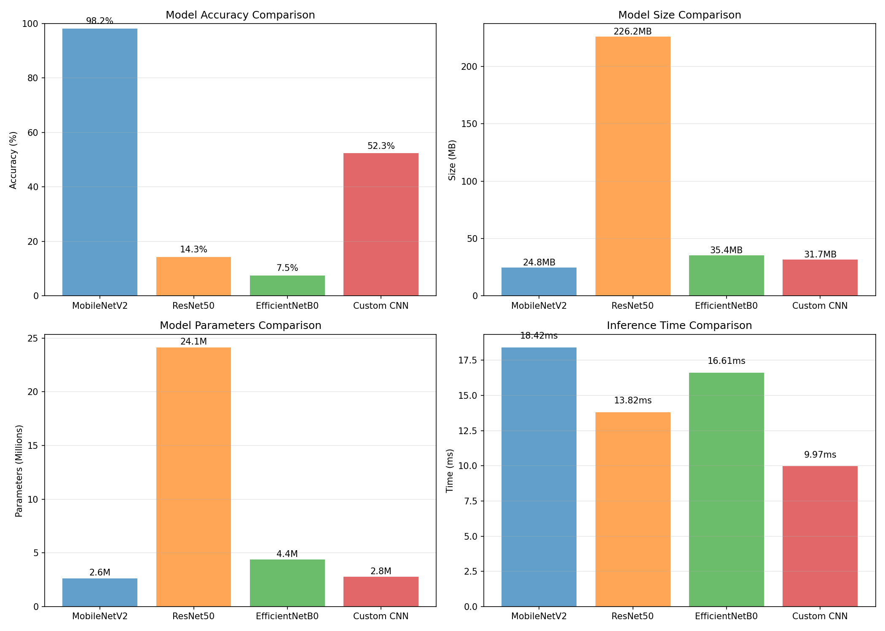
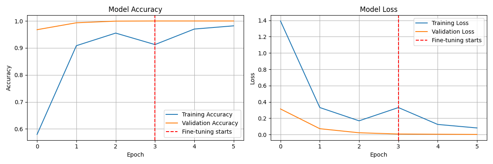
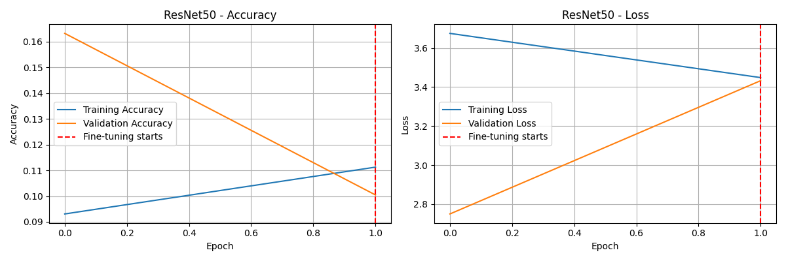
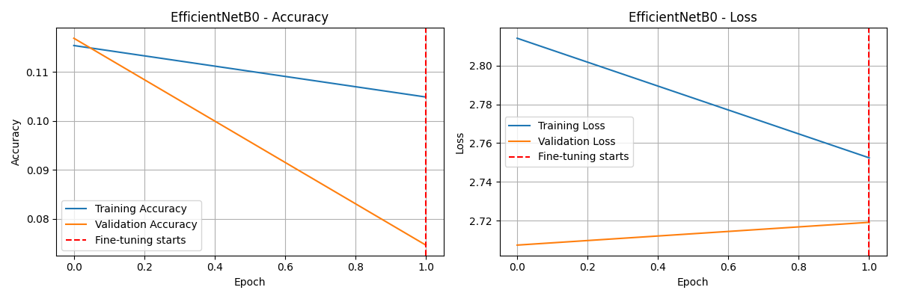
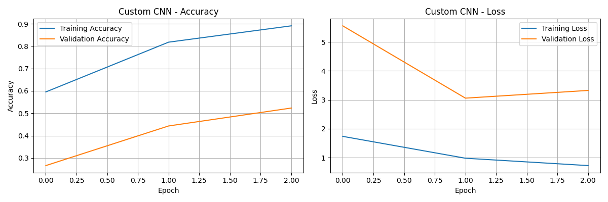

# ISL Model Run Report (Fast Epoch 3)

## Overview
This report summarizes the fast training run (3 epochs) and the comparison results for all four models: MobileNetV2, ResNet50, EfficientNetB0, and Custom CNN.

## How Fast Epoch 3 Training Was Run
The runner script enables fast mode by default when no flags are passed. Fast mode sets the environment variables below for all training scripts:

- `ISL_FAST_TRAIN=1`
- `ISL_FAST_EPOCHS=3`

This run used fast mode with 3 epochs per model. You can reproduce it using:

```bash
python RUN_ALL_MODELS_AND_COMPARE.py --fast-epochs 3
```

## Dataset Summary
- Data directory: Data
- Image size: 224 x 224
- Validation split: 0.2
- Training samples: 7216
- Validation samples: 1796

## Results Table
| Model | Epochs | Train Samples | Val Samples | Accuracy (%) | Loss | Parameters | Model Size (MB) | Inference Time (ms) |
| --- | --- | --- | --- | --- | --- | --- | --- | --- |
| MobileNetV2 | 3 | 7216 | 1796 | 98.22 | 0.1243 | 2,621,009 | 24.81 | 18.42 |
| ResNet50 | 3 | 7216 | 1796 | 14.25 | 3.4641 | 24,148,881 | 226.17 | 13.82 |
| EfficientNetB0 | 3 | 7216 | 1796 | 7.46 | 2.7189 | 4,382,900 | 35.40 | 16.61 |
| Custom CNN | 3 | 7216 | 1796 | 52.34 | 3.3224 | 2,759,729 | 31.74 | 9.97 |

## Result Files
- Comparison JSON: [model_comparison_results.json](./model_comparison_results.json)
- Run metadata: [training_run_metadata.json](./training_run_metadata.json)
- Comparison chart: [model_comparison.png](./model_comparison.png)

## Comparison JSON (Tabular)
| Model | Accuracy | Loss | Parameters | Model Size (MB) | Inference Time (ms) | Epochs | Train Samples | Val Samples |
| --- | --- | --- | --- | --- | --- | --- | --- | --- |
| MobileNetV2 | 0.9822 | 0.1243 | 2,621,009 | 24.81 | 18.42 | 3 | 7216 | 1796 |
| ResNet50 | 0.1425 | 3.4641 | 24,148,881 | 226.17 | 13.82 | 3 | 7216 | 1796 |
| EfficientNetB0 | 0.0746 | 2.7189 | 4,382,900 | 35.40 | 16.61 | 3 | 7216 | 1796 |
| Custom CNN | 0.5234 | 3.3224 | 2,759,729 | 31.74 | 9.97 | 3 | 7216 | 1796 |

## Training Run Metadata (Tabular)
| Field | Value |
| --- | --- |
| Data directory | Data |
| Image size | 224 |
| Validation split | 0.2 |

| Model | Epochs | Train Samples | Val Samples |
| --- | --- | --- | --- |
| MobileNetV2 | 3 | 7216 | 1796 |
| ResNet50 | 3 | 7216 | 1796 |
| EfficientNetB0 | 3 | 7216 | 1796 |
| Custom CNN | 3 | 7216 | 1796 |

## Charts
### Comparison Summary


### Training History (Per Model)
#### MobileNetV2


#### ResNet50


#### EfficientNetB0


#### Custom CNN


## Notes
- Per-class accuracy details are stored in [model_comparison_results.json](./model_comparison_results.json).
- Fast mode is intended for quick comparisons and sanity checks; for higher accuracy, run full training with `--full` or raise epochs with `--epochs`.
